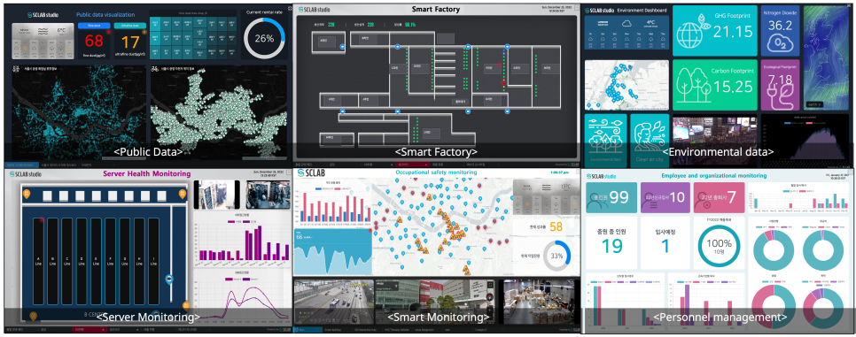

Data visualization is essential for industries that require data analysis, decision-making, and stakeholder communication, and successful digital transformation can be achieved in various data visualization industries.

Government and Public Agencies: Data visualization is essential for public data to be accessible and understandable. We regularly monitor vast amounts of data, from census data to weather patterns, crime statistics, medical data, and more. With the city’s map data, and GIS (Geographic Information System), you can plan your city’s infrastructure through various spatial analyses. It also helps government agencies and policymakers make informed decisions and makes data easily accessible and understandable to the public. SCLAB Studio can help government managers or data-hungry service providers create interactive dashboards that make exploring public data and gaining insights quick.

Smart Factory: In a smart factory, data visualization can help improve efficiency, optimize operations and reduce costs. SCLAB Studio can help by creating real-time dashboards that monitor machine health, production data, and other vital metrics. This data can be visualized in charts, graphs, and gauges, making it easy to identify trends and patterns and take corrective action quickly.

Intelligent environmental monitoring: Environmental data is critical for intelligent environmental monitoring, providing real-time information on air and water quality, weather patterns, and other environmental factors. This information can be visualized in maps, charts, and graphs to understand environmental conditions better. SCLAB Studio can help create interactive dashboards displaying data from various sensors and IoT devices. SCLAB Studio can help create interactive dashboards displaying data from various sensors and IoT devices.

Server Health Monitoring: Server health monitoring is essential to ensure server uptime, detect anomalies and troubleshoot problems. SCLAB Studio can help by creating real-time dashboards that monitor server metrics such as CPU usage, memory usage, and network traffic. This data can be visualized in charts, graphs, and tables, so IT teams can easily monitor server health and performance.

Occupational safety monitoring: It is essential for occupational safety monitoring to ensure a safe working environment for employees. SCLAB Studio can help by creating real-time dashboards that monitor safety metrics such as temperature, humidity, air quality, and noise levels. This data can be visualized in charts, graphs, and maps so that safety issues can be easily identified and corrective action taken quickly.

Employee and organizational monitoring: It is essential for personal and organizational monitoring to improve a company’s workforce productivity and efficiency. SCLAB Studio can help by creating dashboards to monitor key performance indicators such as employee attendance, turnover, and productivity. This data can be visualized in charts, graphs, and tables so managers can monitor performance and make informed decisions.

Can improve. Educational institutions use data visualization to track student progress and identify learning trends and teaching outcomes. Beyond that, it can help marketing professionals track campaign performance, identify target audiences, and measure the impact of marketing efforts.

SCLAB Studio can be a tool in such a scenario, allowing governments and public agencies to easily create interactive data visualizations without extensive coding knowledge. It can also help these organizations collaborate and share data across departments and agencies to drive more effective decision-making and policy implementation.