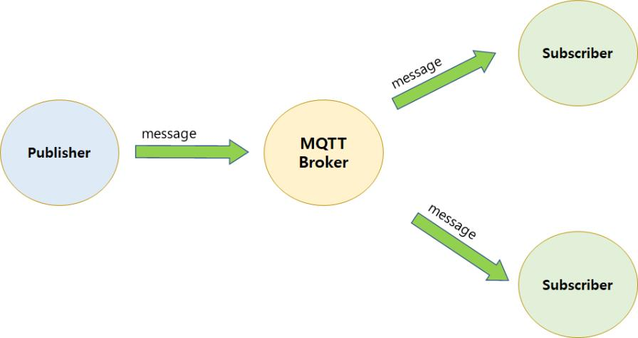
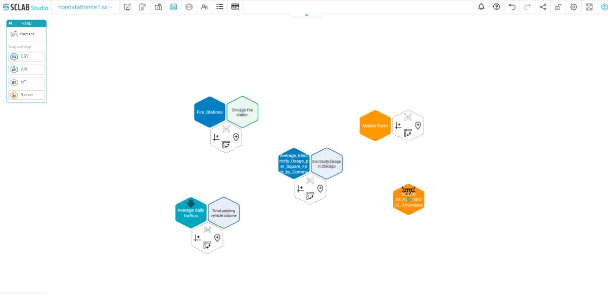
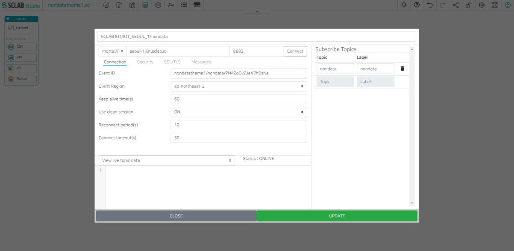
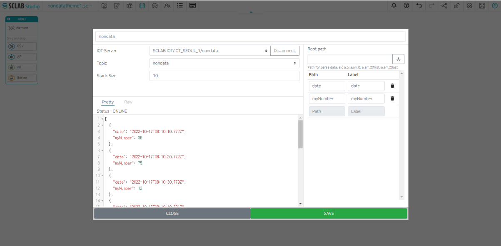
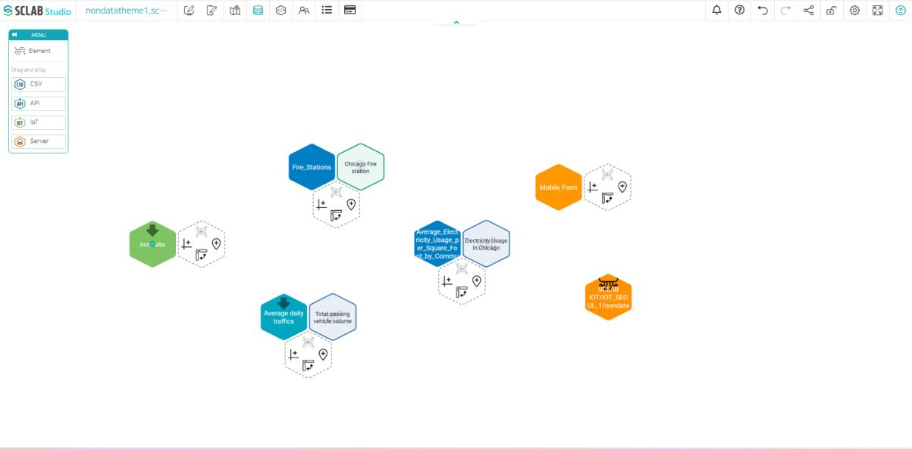

## IoT
- To collect IoT data, the MQTT protocol method is used.
- In the MQTT protocol, the Publisher (providing output value) the and Subscriber (the subscriber who receives the output value) can send and receive messages about a specific topic through the Broker (server).

- You need to know the broker address (IoT server address) and connect from both sides to send and receive messages.
- If you have an external IoT server address, you can use it. If not, you can use the SCLAB IoT server. On the SCLAB Studio development editor page, you can create brokers and topics using the SCLAB IoT server.
- Open the Dev Tool menu and click SCLAB IoT Server on the left.
- If you enter a topic and click the Generate Topic button, you can see that IoT server-related information is created as shown below.
  

- If you go to the data editor, you can see that an orange IoT server icon has been created. IoT server setting is also possible in the data editor. This will be briefly described below.
  

## IoT server setup

- If you drag and drop the orange hexagon Server icon from the data editor, a popup like the one above will appear.
- After checking mqtts://, mqtt://, enter the IoT address, Port, IoT server name, and client ID. Enter the Topic and Label as well.
- In the Security tab, enter your username and password. SSL/TLS and messages can also be modified. Click Connect and check the status at the bottom: ONLINE
- You can view the real-time data of the item by selecting it at the bottom of the View live topic data. Click UPDATE, and an IoT server hexagon is created on the data screen.
  

## IoT data setting

- If you drag and drop the IoT icon from the data editor, a popup like the one above will appear.
- Enter the IoT data name, select the IoT server, and the topic. After entering the stack size, click the Connect button to check the real-time data. Stack size refers to the number of real-time exposures of data.
- Click the A-shaped button under the Root path to display the Path and Label.
- Clicking the SAVE button at the bottom creates a yellow-green IoT data hexagon on the data screen.
  

  

<iframe width="100%" height="640" src="https://www.youtube.com/embed/UslT5QqTucI" title="YouTube video player" frameborder="0" allow="accelerometer; autoplay; clipboard-write; encrypted-media; gyroscope; picture-in-picture; web-share" allowfullscreen></iframe>

  

## IoT Data Flow
